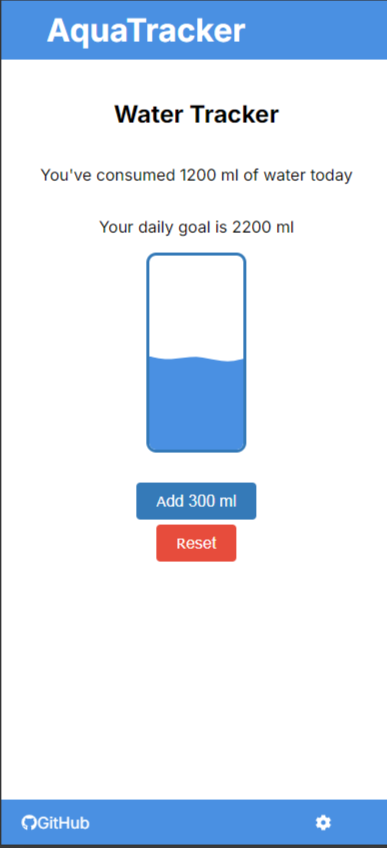
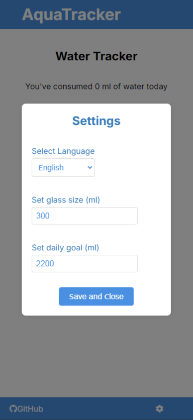

# AquaTracker

**AquaTracker** — это простое веб-приложение, которое помогает вам отслеживать количество выпитой воды в течение дня. Приложение сохраняет объем выпитой воды в локальном хранилище браузера и позволяет легко изменять язык интерфейса и объем стакана, используемого для трекинга.

## Технологии

Проект разработан с использованием следующих технологий:

- **React** - библиотека для создания пользовательских интерфейсов.
- **TypeScript** - надмножество JavaScript, добавляющее статическую типизацию.
- **Stylus** - CSS-препроцессор для написания стилей.
- **i18next** - библиотека для международной локализации в приложениях.
- **React Icons** - библиотека для использования иконок в приложении.
- **Local Storage** - используется для сохранения данных о выпитой воде на стороне клиента.

## Установка и запуск

Следуйте инструкциям ниже для локального запуска проекта:

1. Склонируйте репозиторий на ваш локальный компьютер:
   ```bash
   git clone https://github.com/ваш-username/aquatracker.git
   ```
   
2. Перейдите в директорию проекта:
    ```bash
    cd pomodoro-react
    ```

3. Установите зависимости:
    ```bash
    npm install
    ```

4. Запустите проект:
    ```bash
    npm start
    ```
## Возможности

- **Отслеживание объема выпитой воды** - добавляйте количество выпитой воды в течение дня с помощью кнопки "Add".
- **Сохранение данных** - объем выпитой воды сохраняется в Local Storage, чтобы данные не терялись при перезагрузке страницы. В полночь счетчик сбрасывается.
- **Изменение объема стакана** - настройте объем стакана по умолчанию через меню настроек.
- **Международная локализация** - переключайте язык интерфейса между русским и английским языками.
- **Ссылка на GitHub** - в футере приложения находится ссылка на мой профиль GitHub.

## Скриншоты




## Планируемые улучшения

- **Уведомления** - добавление уведомлений для напоминания о необходимости выпить воду.
- **Аналитика** - отображение статистики выпитой воды за неделю/месяц (будет реализовано с помощью серверной части на python и api).
- **Рефакторинг кода** - провести рефакторинг стилий в коде. Во время разработки автор положил на это болт.
- **Добавление комментариев в код** - добавить комментарии для лучшей читаемости кода.

## Использование

Этот проект открыт для всех и может быть использован любым желающим.

## Автор

Создано для изучения React и TypeScript. Автор: [Andrew Kras](https://github.com/andrew-kras/)
